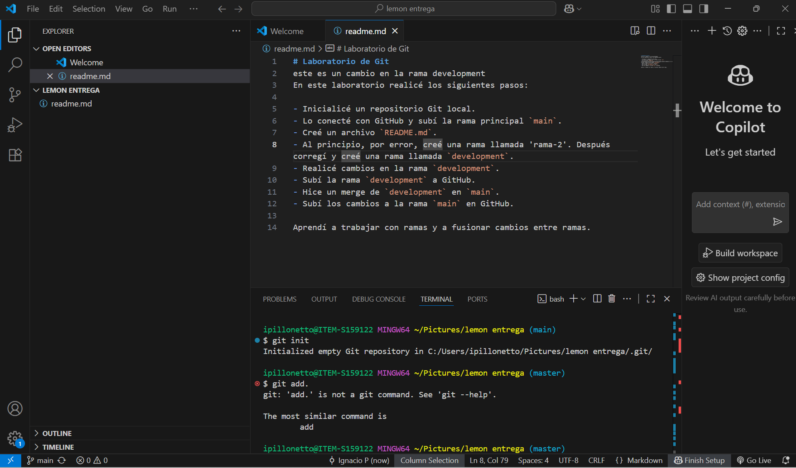
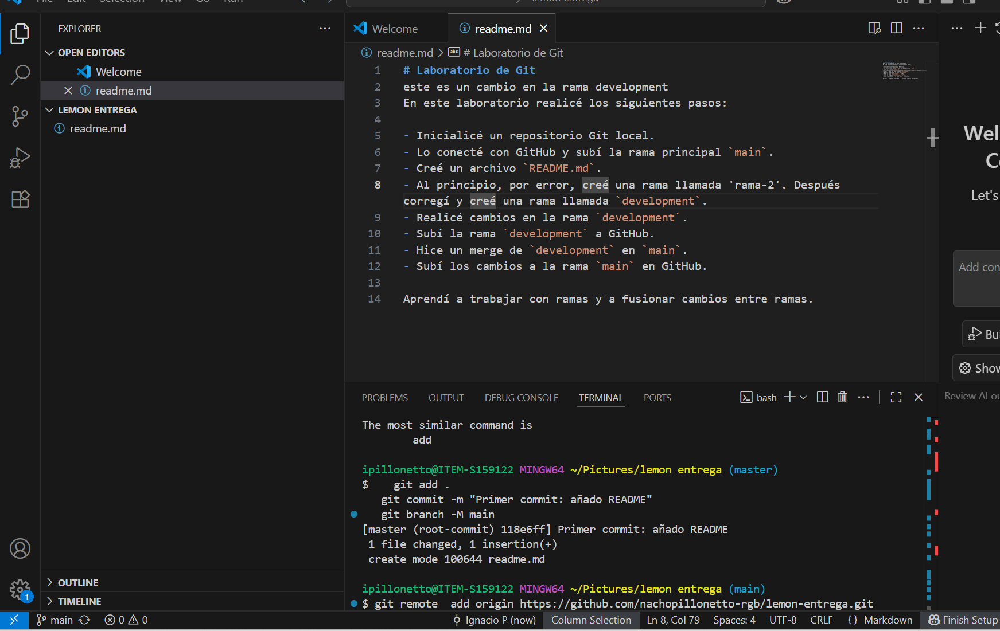
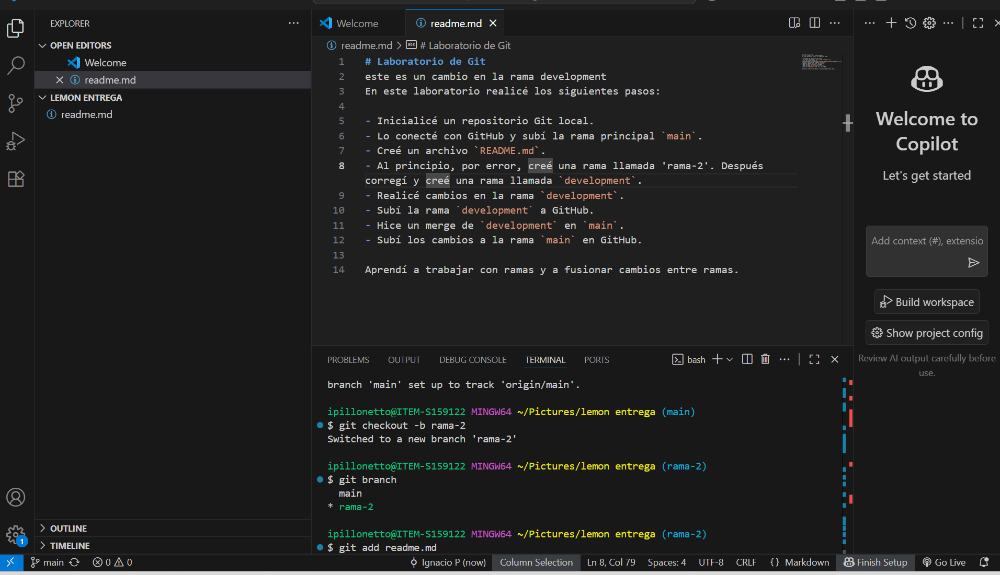
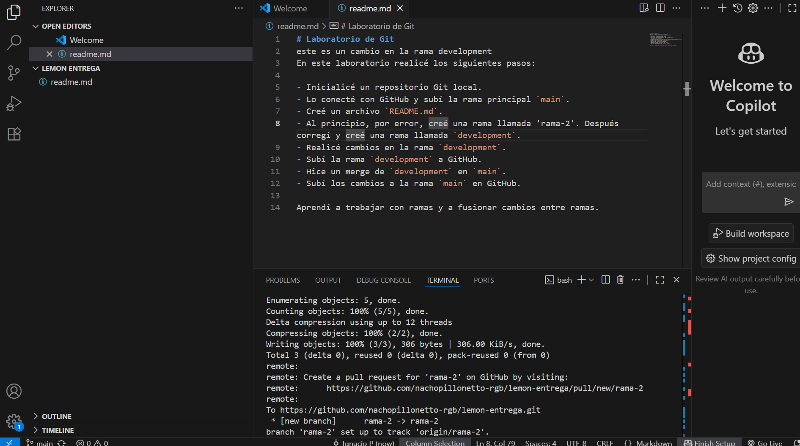
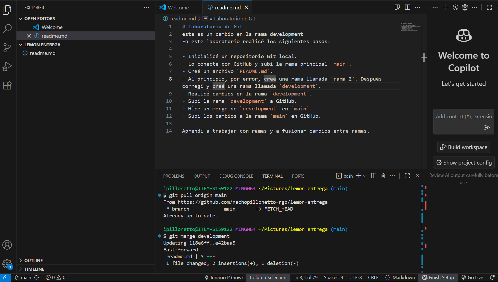

# Laboratorio de Git
este es un cambio en la rama development
En este laboratorio realicé los siguientes pasos:

- Inicialicé un repositorio Git local.
- Lo conecté con GitHub y subí la rama principal `main`.
- Creé un archivo `README.md`.
- Al principio, por error, creé una rama llamada 'rama-2'. Después corregí y creé una rama llamada `development`.
- Realicé cambios en la rama `development`.
- Subí la rama `development` a GitHub.
- Hice un merge de `development` en `main`.
- Subí los cambios a la rama `main` en GitHub.

Aprendí a trabajar con ramas y a fusionar cambios entre ramas.
## Capturas del laboratorio

